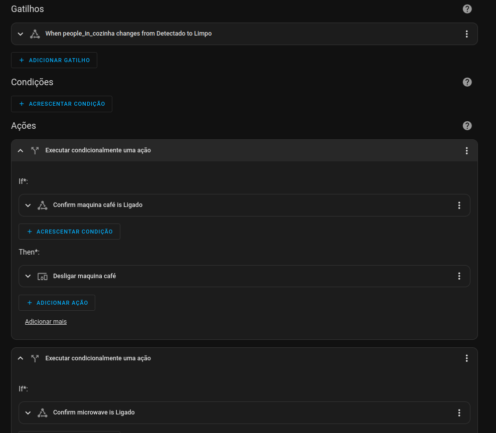
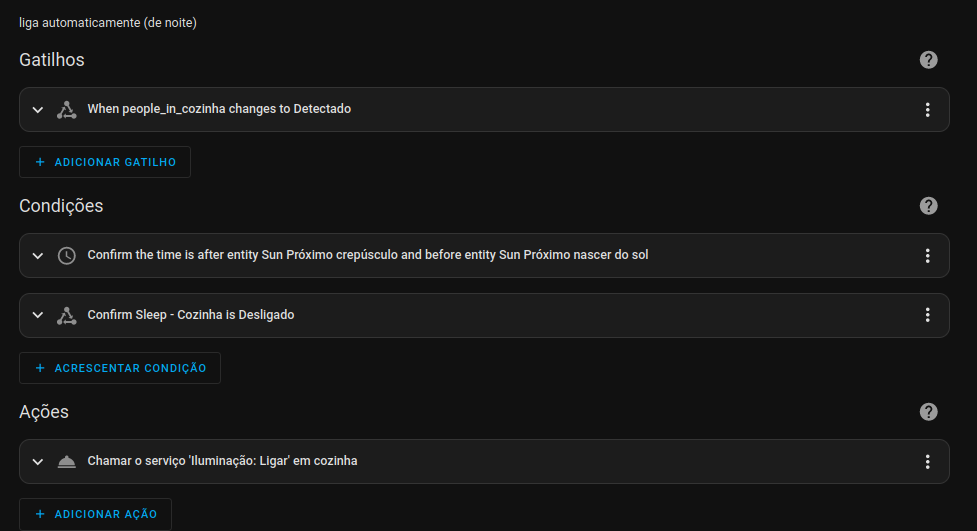
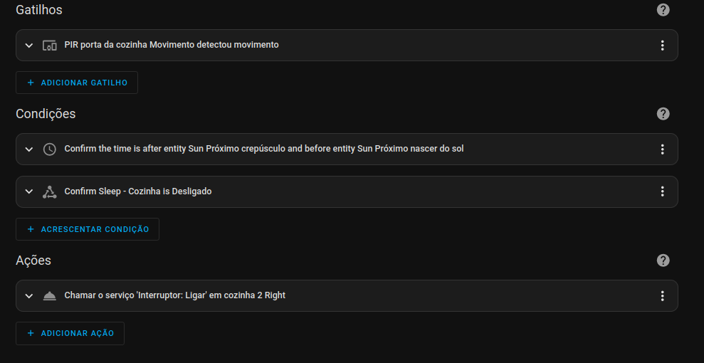
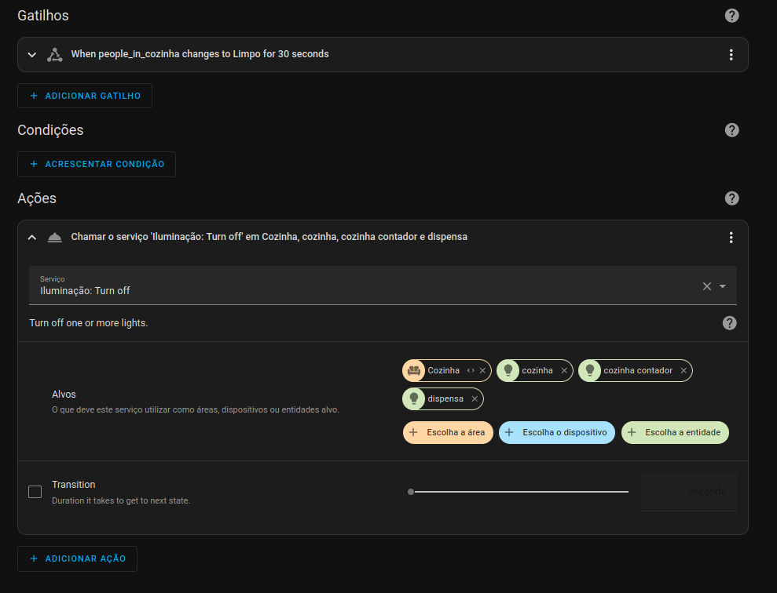
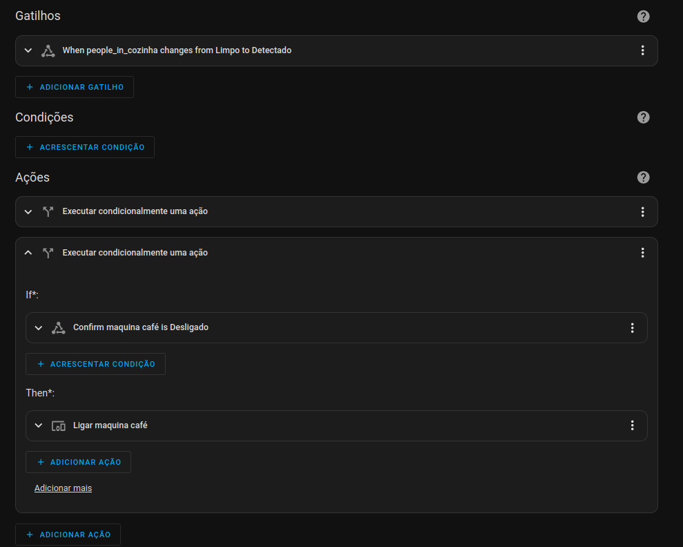

# Cozinha

## Menu

- [Home](./readme.md)
- How it works
  - [Software](./how/software.md)
  - [Lights](./how/lights.md)
  - [Occupancy](./how/occupancy.md)
  - [Energy Monitoring](./how/energy.md)
- Dumb2Smart
  - [Microwave](./dumb2smart/microwave.md)
  - [Coffee Machine](./dumb2smart/coffee_machine.md)

## Ligações

ligações:
- [marquise](./marquise.md)
- [corredor 1](./corredores.md)

## B.O.M

 
 
 
 

- PIR: 3
- Temperature: 1
- Light Switch: 2
  - [switch TS0011](https://www.zigbee2mqtt.io/devices/TS0011_switch_module.html#tuya-ts0011_switch_module) cozinha - 1 times ? W lamps
  - [switch TS0012](https://www.zigbee2mqtt.io/devices/TS0012_switch_module.html#tuya-ts0012_switch_module) cozinha 2 - 1 times ? W lamps   ( + 1 unused gang)
  - [switch TS0012](https://www.zigbee2mqtt.io/devices/TS0012_switch_module.html#tuya-ts0012_switch_module) marquise - 1 times ? W lamps   ( + 1 unused gang)
- Smart Plugs: 6 
  - [plug ts011f](https://www.zigbee2mqtt.io/devices/TS011F_plug_1.html#tuya-ts011f_plug_1) - microwave
  - [plug ts011f](https://www.zigbee2mqtt.io/devices/TS011F_plug_1.html#tuya-ts011f_plug_1) - fridge
  - [plug ts011f](https://www.zigbee2mqtt.io/devices/TS011F_plug_1.html#tuya-ts011f_plug_1) - freezer
  - [plug ts011f](https://www.zigbee2mqtt.io/devices/TS011F_plug_1.html#tuya-ts011f_plug_1) - dishwasher
  - [plug ts011f](https://www.zigbee2mqtt.io/devices/TS011F_plug_1.html#tuya-ts011f_plug_1) - coffee machine
  - [plug ts011f](https://www.zigbee2mqtt.io/devices/TS011F_plug_1.html#tuya-ts011f_plug_1) - air fryer
- Door Sensors: 4 (fridge | fridge_freezer | freezer | microwave)

Armarios; (dispensa)
  - Light Switch: 1  
    - [switch TS0011](https://www.zigbee2mqtt.io/devices/TS0011_switch_module.html#tuya-ts0011_switch_module) dispensa - 1 times ? W lamps
  - Door Contact: 0 - (TODO - 1)
  - Window Contact: 0 - (TODO - 1)

## Automations

### Occupancy

when any condition triggers -> cozinha occupancy is **on**:
- fridge door open
- freezer door open
- microwave door open
- microwave heating
- coffee machine working
- PIR sensor (movement)
- lights on

### Lights on

when cozinha occupancy is **on**:
- if its night
- if sleep_cozinha is off
- lights on

#### Lights on - porta

when **movement detected**:
- if its night
- if sleep_cozinha is off
- lights on

### Lights off

when cozinha occupancy is **off**:
- lights off

### Eletrodomesticos Off

when cozinha occupancy is **off**:
- coffee machine off
- microwave off

