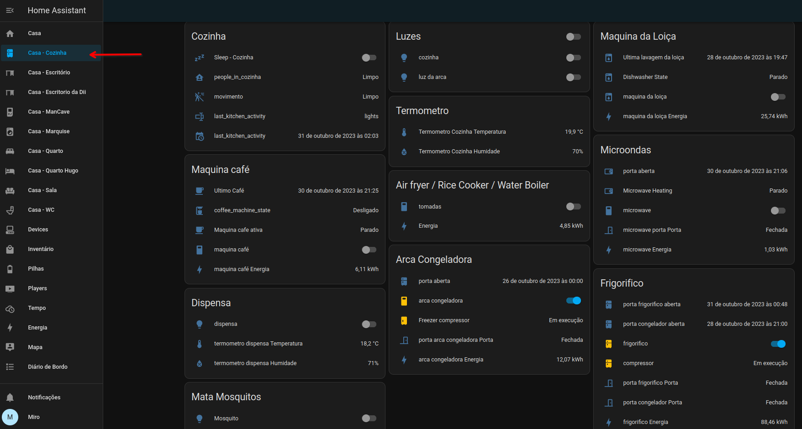
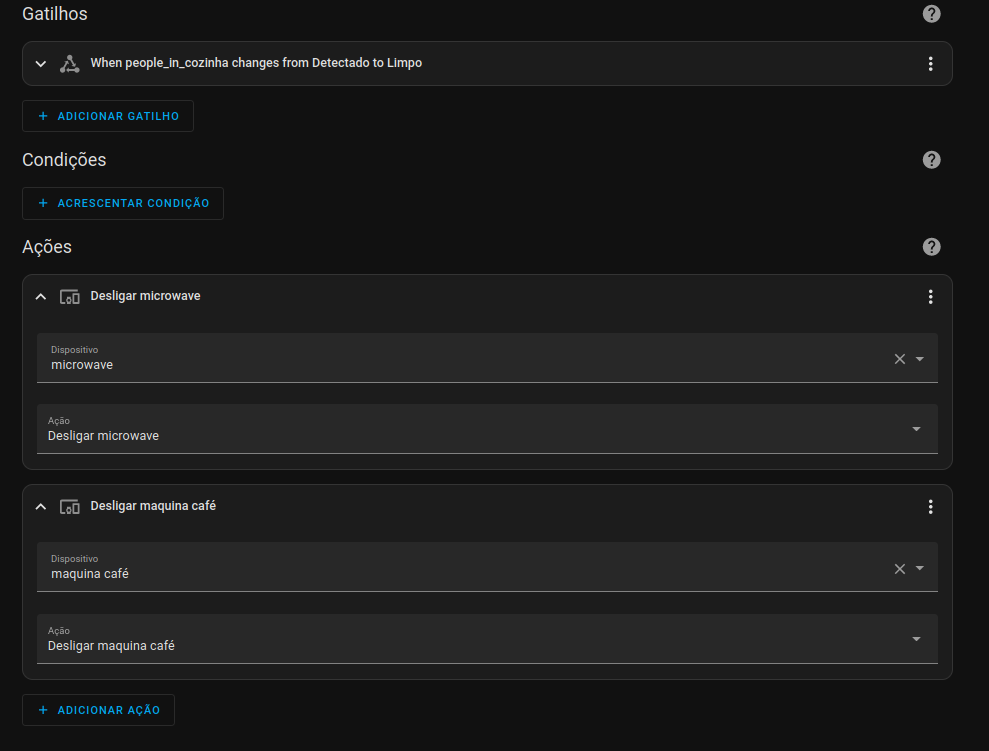

# Cozinha

ligações:
- [marquise](./marquise.md)
- [corredor 1](./corredores.md)

## Menu

- [Home](./readme.md)
- How it works
  - [Lights](./lights.md)
  - [Occupancy](./occupancy.md)
- Dumb2Smart
  - [Microwave](./dumb2smart/microwave.md)
  - [Coffee Machine](./dumb2smart/coffee_machine.md)
- Divisões:
  - [corredores](./corredores.md)
  - [sala](./sala.md)
  - [mancave](./mancave.md)
  - [escritorio](./escritorio.md)
  - [quarto](./quarto.md)
  - [quarto hugo](./quarto_hugo.md)
  - [wc](./wc.md)
  - [marquise](./marquise.md)
  - [Escritorio da Dii](./escritorio_dii.md)
  - [WC da Dii](./wc_dii.md)

## B.O.M

- PIR: 3
- Temperature: 1
- Light Switch: 2
- Smart Plugs: 7 (fridge | freezer | coffee | microwave | dishwasher | air fryer)
- Door Sensors: 4 (fridge | fridge_freezer | freezer | microwave)

Armarios; (dispensa)
  - Light Switch: 1  
  - Door Contact: 0 - (TODO - 1)
  - Window Contact: 0 - (TODO - 1)

## Automations

### Occupancy

when any condition triggers -> cozinha occupancy is **on**:
- fridge door open
- freezer door open
- microwave door open
- microwave heating
- coffee machine working
- PIR sensor (movement)
- lights on

### Lights on

when cozinha occupancy is **on**:
- if its night
- if sleep_cozinha is off
- lights on

#### Lights on - porta

when **movement detected**:
- if its night
- if sleep_cozinha is off
- lights on

### Lights off

when cozinha occupancy is **off**:
- lights off

### Eletrodomesticos Off

when cozinha occupancy is **off**:
- coffee machine off
- microwave off

