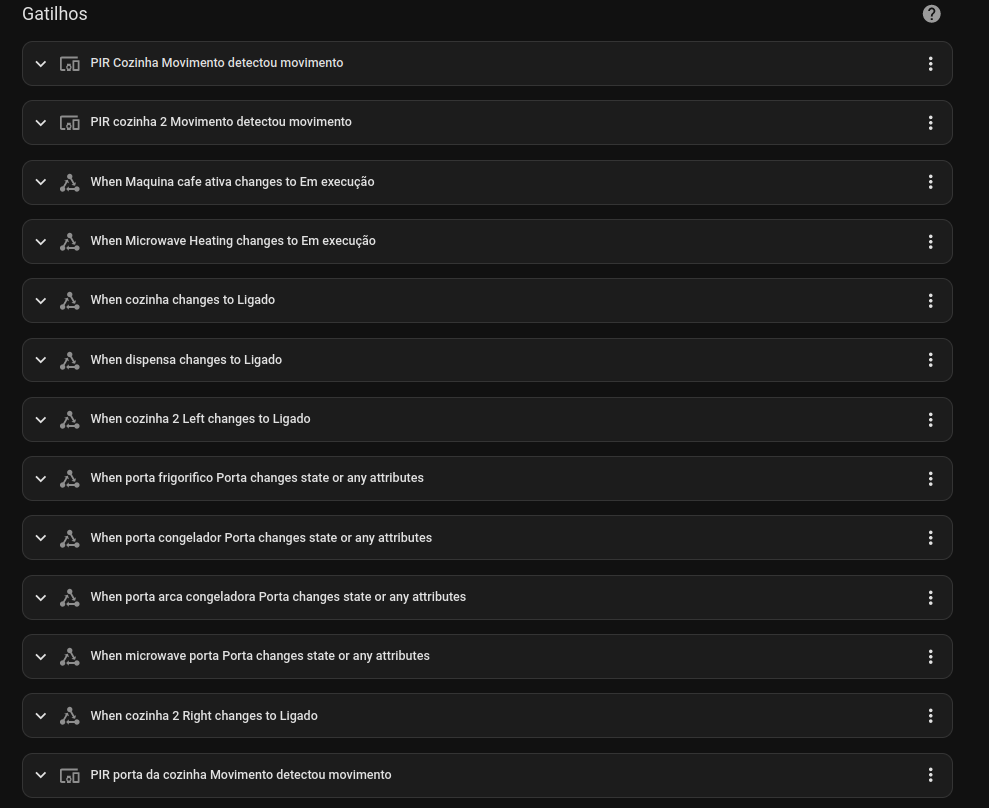

# Cozinha

ligações:
- [marquise](./marquise.md)
- [corredor 1](./corredores.md)

## Docs
- [Home](./readme.md)
- [Lights](./lights.md)
- [Occupancy](./occupancy.md)

## B.O.M

- PIR: 3
- Temperature: 1
- Light Switch: 2
- Smart Plugs: 7 (fridge | freezer | coffee | microwave | dishwasher | air fryer)
- Door Sensors: 4 (fridge | fridge_freezer | freezer | microwave)

Armarios; (dispensa)
  - Light Switch: 1  
  - Door Contact: 0 - (TODO - 1)
  - Window Contact: 0 - (TODO - 1)

## Automations

### Lights on

quando ocupação da cozinha é **ligada**:
- Se for de noite
- se sleep da cozinha desligado
- liga luzes

### Lights off

quando ocupação da cozinha é **desligada**:
- deliga luzes

### Eletrodomesticos On

quando ocupação da cozinha é **ligada**:
- se sleep da cozinha desligado
- liga maquina de café
- liga maquina da loiça

### Eletrodomesticos Off

quando ocupação da cozinha é **desligada**:
- se sleep da cozinha desligado
- desliga maquina de café
- desliga microondas

