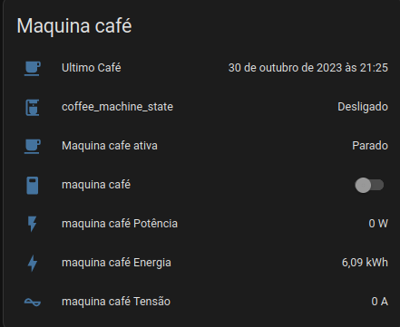
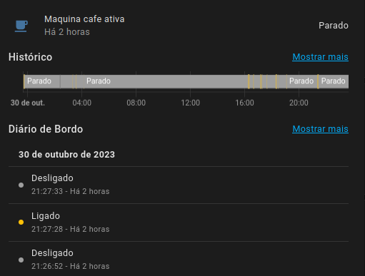
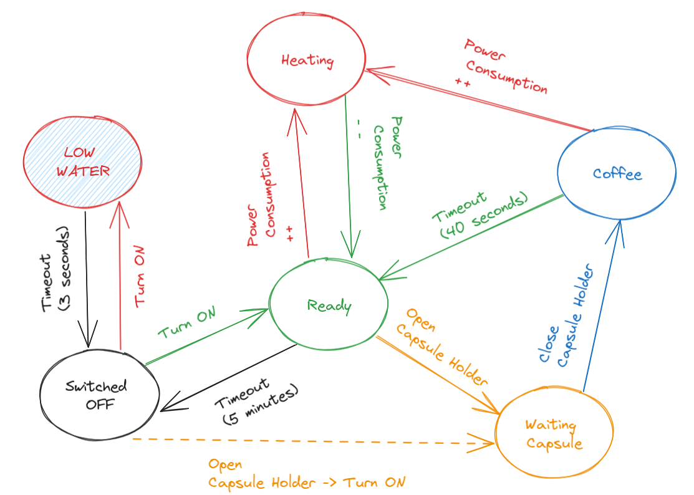

# Coffee Machine

## Navigation

- How it works
  - [Lights](../how/lights.md)
  - [Occupancy](../how/occupancy.md)
  - [Software](../how/software.md)
- Dumb2Smart
  - [Microwave](./microwave.md)

## Requirements:

- Smart Switch: 1
  - [plug ts011f](https://www.zigbee2mqtt.io/devices/TS011F_plug_1.html#tuya-ts011f_plug_1)
- Water Leak: 1
  - [IH-K665](https://www.zigbee2mqtt.io/devices/IH-K665.html#aubess-ih-k665)
- Contact Sensor: 1
  - [TS0203](https://www.zigbee2mqtt.io/devices/TS0203.html#tuya-ts0203)
  
## Features:

- power monitoring
- usage monitoring
- overheating protection / low water alert
- energy saving
- inventory tracking

### Virtual Sensors

detect power usage from smart plug, above a certain value we know machine is heating

### Automations

- when `coffee_machine_switch` is **OFF** + `coffee_machine_capsule_holder` changes to **OPEN** -> `turn on` smart plug
- when `coffee_machine_switch` changes to **ON** + `low_water` is **ON** -> `turn off` smart plug
- when `coffee_machine_capsule_state` changes to **COFFEE** -> update timestamp of `last_coffee_timestamp` 
- when `last_coffee_timestamp` changes -> `deduct_from_inventory` 1 coffee
- when `coffee_machine_switch` is **ON** + `coffee_machine_capsule_holder` changes to **OPEN** -> `turn off` smart plug + `notify` "enjoy your coffee"
- when `coffee_machine_capsule_state` changes to **READY** for 20 minutes -> `turn off` smart plug + `notify` "forgot used capsule"
- when `coffee_machine_switch` changes to **OFF** + `low_water` is **ON** -> `notify` "low water"

