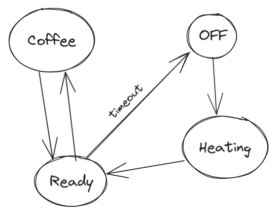

# Coffee Machine

Features:
- power monitoring
- usage monitoring
- energy saving
- inventory tracking

# Energy Saving

- when usage stops for X minutes -> turn off smart plug

# Usage - binary sensor

detect power usage from smart plug, above a certain value we know machine is in use

# Usage Monitoring - State sensor

- turn on smart plug -> heating
- after 40 seconds -> ready
- on usage -> coffee
- on no usage -> ready

# Inventory

when state changes to coffee -> deduct 1 coffee from inventory

update timestamp of last coffee

