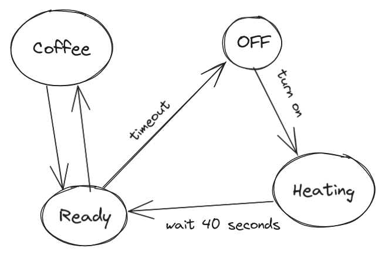

# Coffee Machine

# Usage - binary sensor

detect power usage from smart plug, above a certain value we know machine is in use

# State sensor

- turn on smart plug -> heating
- after 40 seconds -> ready
- on usage -> coffee
- on no usage -> ready
- after 2 minutes of no usage -> turn off smart plug

# Inventory

when state changes to coffee -> deduct 1 coffee from inventory

update timestamp of last coffee

