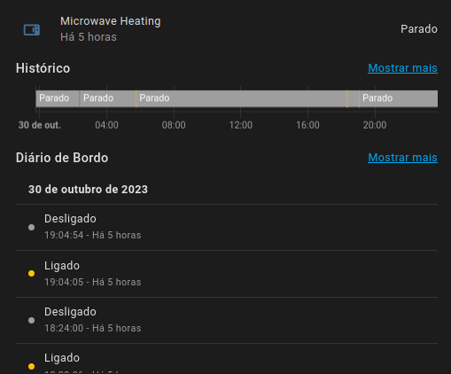
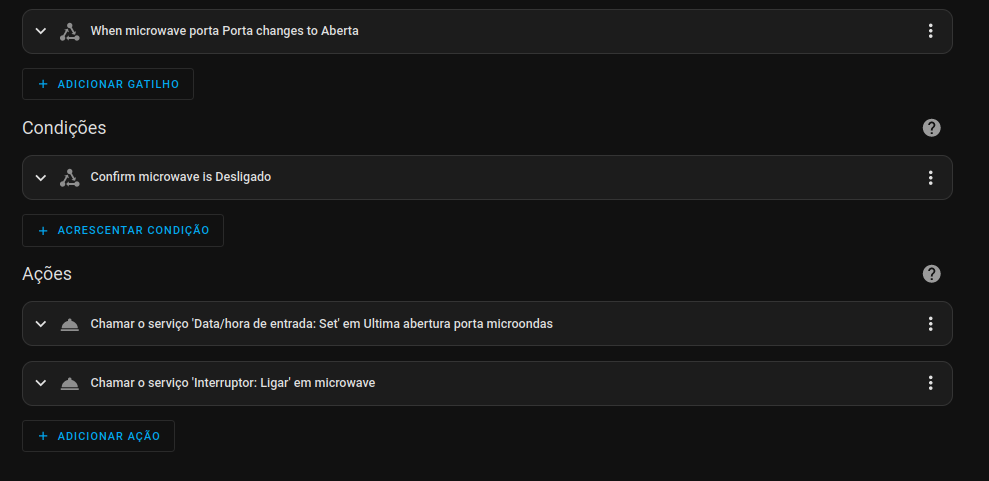

# Microwave

## Menu

- How it works
  - [Lights](../lights.md)
  - [Occupancy](../occupancy.md)
- Dumb2Smart
  - [Coffee Machine](./coffee_machine.md)

## Requirements:
- Smart Switch: 1
- Contact Sensor: 1

## Features:
- power monitoring
- usage monitoring
- energy saving

### Usage - binary sensor

detect power usage from smart plug, above a certain value we know machine is in use

### Usage Monitoring

- on door open -> save timestamp

### Energy Saving

- on door open -> turn on smart plug
- when heating stops for X minutes -> turn off smart plug

