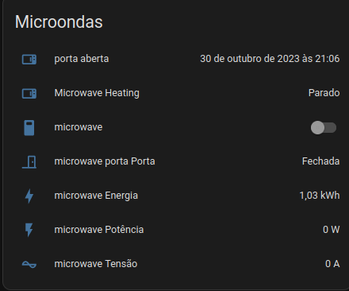
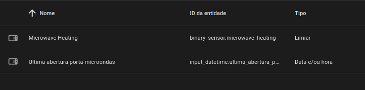

# Microwave

## Navigation

- How it works
  - [Lights](../how/lights.md)
  - [Occupancy](../how/occupancy.md)
  - [Software](../how/software.md)
- Dumb2Smart
  - [Coffee Machine](./coffee_machine.md)

## Requirements:

- Smart Switch: 1
  - [plug ts011f](https://www.zigbee2mqtt.io/devices/TS011F_plug_1.html#tuya-ts011f_plug_1)
- Contact Sensor: 1
  - [TS0203](https://www.zigbee2mqtt.io/devices/TS0203.html#tuya-ts0203)
  
## Features:

- power monitoring
- usage monitoring
- energy saving

### Virtual Sensors

detect power usage from smart plug, above a certain value we know machine is in use

### Automations

- when `microwave_door` changes to **OPEN** -> `turn on` smart plug
- when `microwave_door` changes to **CLOSED** for `5 minutes`  -> `turn off` smart plug
