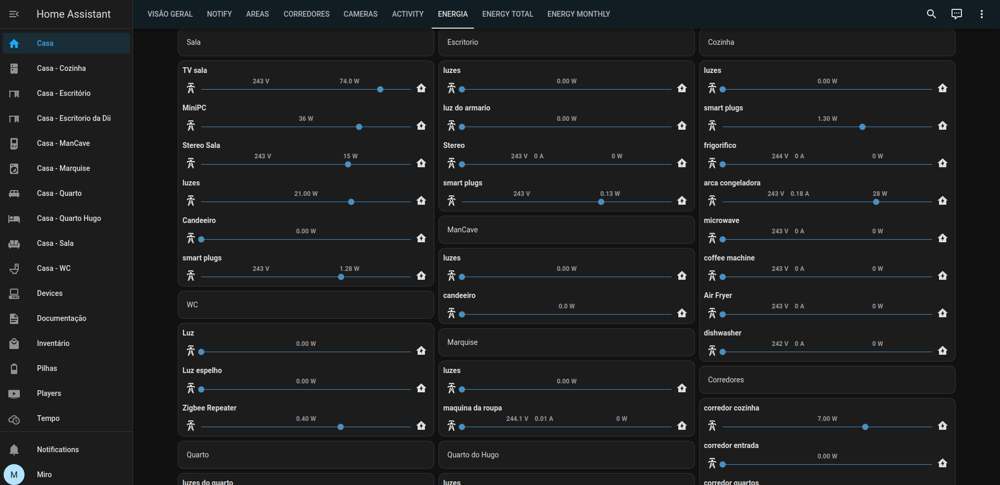

# Energy Monitoring

## Menu

- [Home](../readme.md)
- How it works
  - [Software](software.md)
  - [Lights](lights.md)
  - [Occupancy](occupancy.md)
  - [Energy Monitoring](energy.md)
- Dumb2Smart
  - [Microwave](../dumb2smart/microwave.md)
  - [Coffee Machine](../dumb2smart/coffee_machine.md)

# Live Energy View

Live View for energy usage, monitor which devices are consuming energy real time

# Estimating costs

using [PowerCalc](https://homeassistant-powercalc.readthedocs.io/en/latest/quick-start.html) and [PowerGuess](https://github.com/OpenJarbas/powerguess)

## Switchs with Lights

When we have a switch in home assistant we can estimate power usage based on when devices are on, 
[PowerCalc](https://homeassistant-powercalc.readthedocs.io/en/latest/quick-start.html) makes this simple to do

Hallways
- switch 1 - 1 times N W lamps
- switch 2 - 3 times N W lamps
- switch 3 - 3 times N W lamps

Kitchen
- switch 1 - 1 times N W lamps
- switch 2 - 1 times N W lamps
- switch 3 - 1 times N W lamps

Living Room
- switch 1 - 3 times N W lamps
- switch 2 - 3 times N W lamps
- switch 3 - 3 times N W lamps
- switch 4 - 2 times N W lamps
- plug 1 - 2 times N W lamps

  
## Fixed costs

For each always on device not connected to a sensor we can estimate a fixed cost, measure the consumption once and then create a sensor

- [zigbee repeater](https://www.zigbee2mqtt.io/devices/TS0207_repeater.html) Hallway - 0.4W -> always on
- [zigbee repeater](https://www.zigbee2mqtt.io/devices/TS0207_repeater.html) WC - 0.4W -> always on

B.O.M.

 

## Linux Devices
- MiniPC - can be considered a fixed cost, connected to a smart plug, or run [PowerGuess](https://github.com/OpenJarbas/powerguess) to provide an estimate
- RaspberryPi - can be considered a fixed cost, connected to a smart plug, or run [PowerGuess](https://github.com/OpenJarbas/powerguess) to provide an estimate
  
## Batteries

- Phones - the companion home assistant app usually provides the battery power (W) and state (charging/discharging), this can be used to estimate input/output energy and add the battery to Home Assistant
- Laptops - run [PowerGuess](https://github.com/OpenJarbas/powerguess), a linux utility that will also report battery power (W) and state (charging/discharging), this can be used to estimate input/output energy and add the battery to Home Assistant

