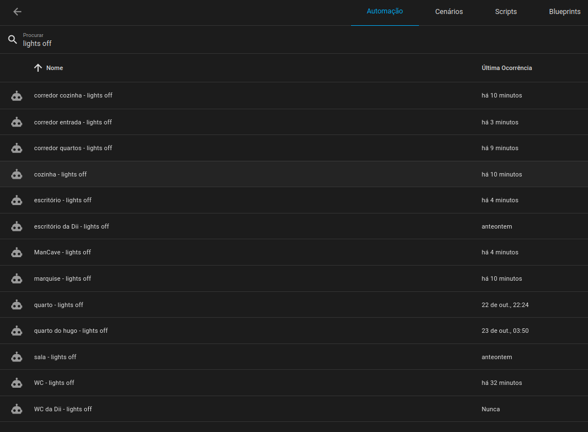
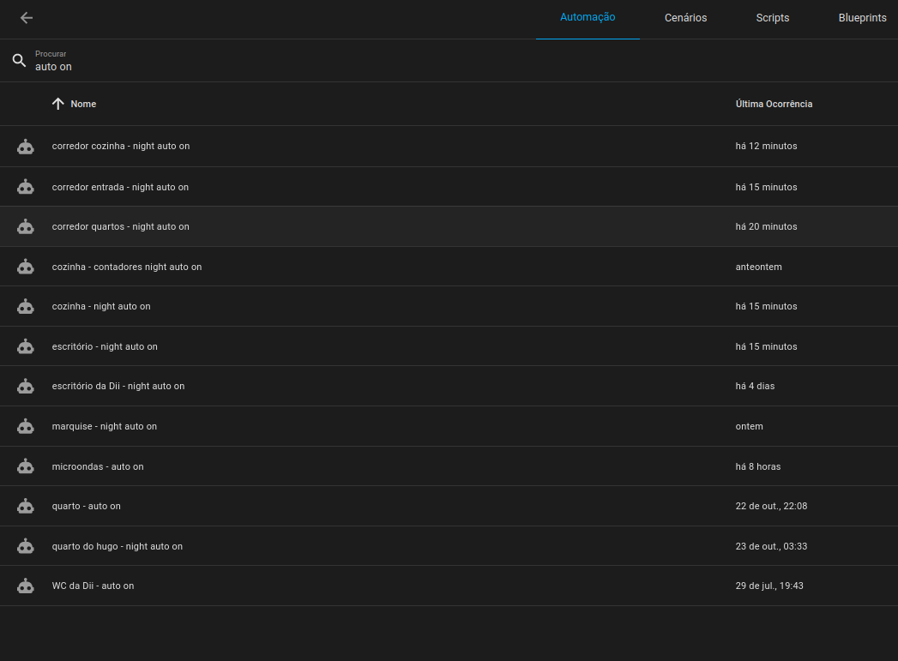

# Lights

## Menu

- [Home](./readme.md)
- How it works
  - [Occupancy](./occupancy.md)
- Dumb2Smart
  - [Microwave](./dumb2smart/microwave.md)
  - [Coffee Machine](./dumb2smart/coffee_machine.md)

# Energy Saving

- if `people_in_XXX` turns off
  - turn off all lights

# Auto On

- if `people_in_XXX` turns on
  - if it's night
  - if room sleep is off
  - turn lights on

