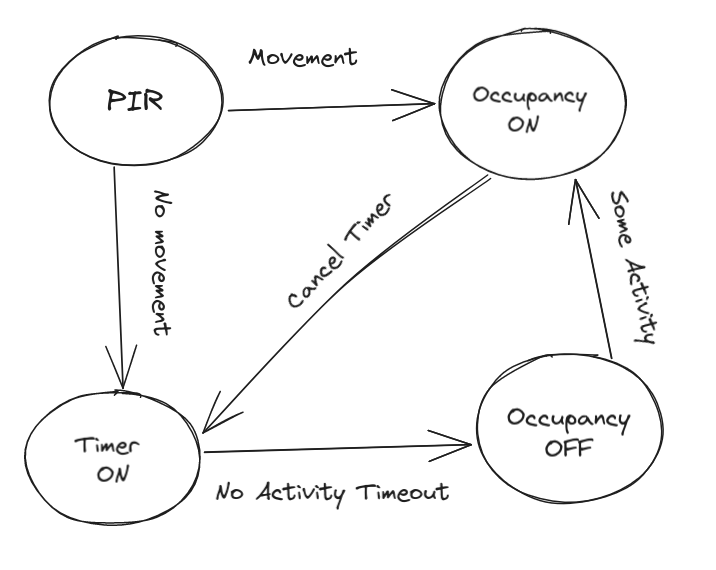

# Occupancy


## Menu

- [Home](./readme.md)
- How it works
  - [Software](./software.md)
  - [Lights](./lights.md)
- Dumb2Smart
  - [Microwave](./dumb2smart/microwave.md)
  - [Coffee Machine](./dumb2smart/coffee_machine.md)


*Welcome to my home automation journey! Today, I'll guide you through setting up a smart occupancy detection system that is not only convenient but also energy-efficient. 
In this system, occupancy sensors are turned on by various triggers, but they are only turned off when corridor sensors detect movement, serving as choke points signaling room transitions.*

# Setup

Imagine a home that responds to your presence, turning on lights and adjusting the environment to your liking, and then intelligently turning off devices when you leave a room. 
It's more than just convenient; it's a greener, more efficient way to live.

## What You'll Need

Here are the key components for this project:

- **Home Assistant**: If you haven't already, set up Home Assistant on your chosen hardware. Home Assistant will be the control center for your smart home devices and automations.
- **PIR (Passive Infrared) Sensors**: PIR sensors are essential for detecting motion in rooms. You'll need one sensor for each room you want to monitor.
- **Corridor Sensors**: You'll need corridor sensors to serve as choke points for turning off room occupancy sensors.
- **Binary Sensors**: Create binary sensors in Home Assistant for each room to track occupancy status. These sensors will indicate whether a room is occupied or not.
- **Optional Smart Devices**: You can integrate other smart devices such as smart lights and media players to enhance your automation. When a device is used turn on room occupancy sensors or block occupancy from being turned off


## Configuring PIR Sensors

1. **Connect PIR Sensors**: Follow the manufacturer's instructions connect your PIR sensors to Home Assistant. We use Zigbee sensors
2. **Home Assistant Configuration**: In your Home Assistant configuration, create binary sensors for each room. Here's an example YAML configuration for a binary sensor in a room named "Sala":

```yaml
- trigger:
 - platform: event
   event_type: people_sala_update
 binary_sensor:
   - name: "people_in_sala"
     state: "{{ trigger.event.data.state }}"
     device_class: "occupancy"
```

3. **Automate Room Occupancy**: Set up automation rules for each room to turn on the occupancy status based on PIR sensor events and other triggers.
4. **Automate Corridor Changes**: Create automation rules for your corridor sensors to turn off room occupancy sensors. Check for certain activities (such as watching TV) to avoid turning occupancy off

Repeat this process for each room, ensuring that corridor sensors are set up as choke points to turn off room occupancy sensors when they detect movement.


               WC da Dii
                 |
           Escritorio da Dii
                 |
              Marquise
                 |
              Cozinha 
                 |       
              Corredor 1
                __________     Outside
                |        |       |
                Sala    Corredor 2
                  ;     ________________
                  ;     |     |        |
                  ManCave  Escritorio  Corredor 3
                                       _____________________
                                       |      |            |
                                       Quarto Quarto Hugo  WC


## PIR automations

PIR sensor automations overview




               WC da Dii <- people_wc_dii_update:ON + people_escritorio_dii_update:OFF
                  |
           Escritorio da Dii <- people_escritorio_dii_update:ON + people_wc_dii_update:OFF + people_marquise_update:OFF
                  |
              Marquise  <- people_marquise_update:ON + people_escritorio_dii_update:OFF + people_kitchen_update:OFF
                  |
              Cozinha <- people_kitchen_update:ON + people_marquise_update:OFF
                 |
             Corredor 1   <- people_sala_update:OFF + people_kitchen_update:OFF
             |        |
           Sala       |   <- people_sala_update:ON
                 Corredor 2 <- people_mancave_update:OFF + people_escritorio_update:OFF
                  |     |      |
            ManCave     |      | <- people_mancave_update:ON
                  Escritorio   | <- people_escritorio_update:ON
                               Corredor 3 <- people_wc_update:OFF + people_quarto_update:OFF + people_quarto_hugo_update:OFF
                                 |  |     |
                                WC  |     | <- people_wc_update:ON
                                   Quarto |  <- people_quarto_update:ON
                                          Quarto Hugo <- people_quarto_hugo_update:ON


Extra occupancy sensor triggers -> people_XXX_update:ON

- window state changes
- light turned on
- closet door open
- electrodomestic usage detected (coffee machine, microwave, fridge door...)
- media playback detected (chromecast, spotify...)

Extra occupancy off blockers-> if in use, do not allow people_XXX_update:OFF

- electrodomestic door open (microwave door, fridge door...)
- electrodomestic in use (coffee machine, microwave...)
- media playback detected (chromecast, spotify...)


create automations to set the state of sensors created above, by emitting a event
```
event: people_XXX_update
event_data:
  state: "on"
```
```
event: people_XXX_update
event_data:
  state: "off"
```
## Enjoy a Smarter Home

Once you've set up this system, your home will automatically respond to your presence and turn off devices when you leave a room. You'll enjoy the convenience and energy savings of a fully automated smart home.

Feel free to fine-tune your automations and explore more ways to make your home even smarter. If you encounter any issues or have questions, the Home Assistant community is a great resource for support and ideas. Have fun and enjoy the benefits of your new intelligent home occupancy system!

